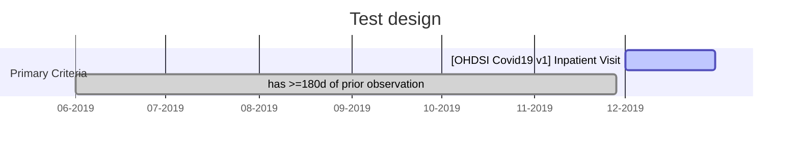



We seek to understand implications of the ACE-2 pathway, which can serve as an entry point for COVID-19 and is also upregulated by ACE inhibitors and Angiotensin Receptor Blockers. We will compare ACE and ARB vs. other anti-hypertensive drugs (calcium channel blockers, thiazide diuretics) to evaluate: 1) ‘susceptability’: amongst new users, what is the risk of Covid-19 positive? and 2) ‘severity’: amongst Covid-19 cases who are prevalent users, what is the risk of viral complication?

# Databases

Data source | Source population | Sample size | Data type | Longitudinal history
--------------|----------------|--------------|-----|----
South Korea: Health Insurance and Review Assessment (HIRA) |All citizens in South Korea  | ≈ 50 million|Administrative fee-for-service claims data|5-years of available look-back
Columbia University Irving Medical Center|Patients of the Columbia University Irving Medical Center|≈ 6 million|General practice electronic health records, outpatient specialist electronic health records, inpatient hospital electronic health records, hospital billing/summary|1989 (1978 for diagnoses)

# Design

# Coverage

https://blogs.sciencemag.org/pipeline/archives/2020/04/11/the-latest-hydroxychloroquine-data-as-of-april-11


