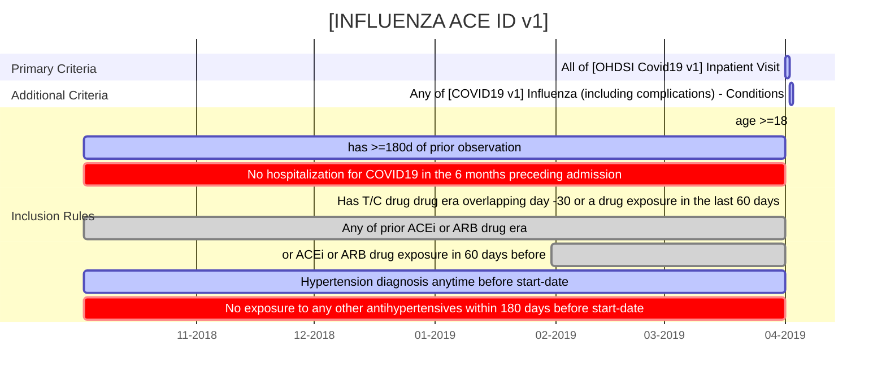
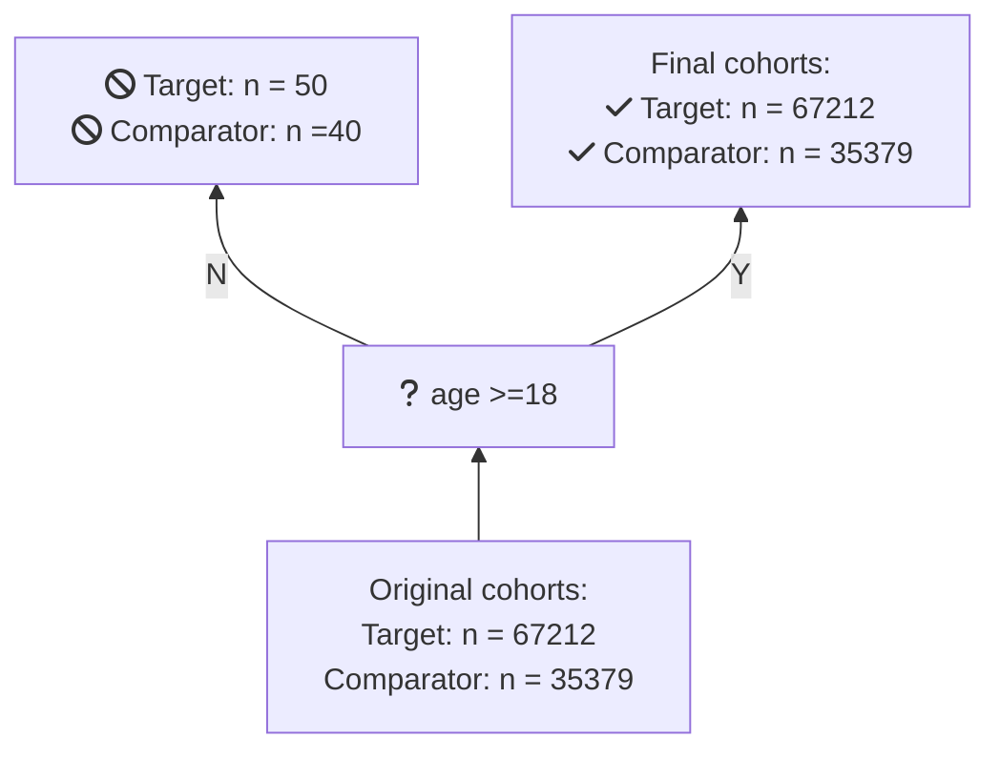

# Databases

Data source | Source population | Sample size | Data type | Longitudinal history
--------------|----------------|--------------|-----|----
South Korea: Health Insurance and Review Assessment (HIRA) |All citizens in South Korea  | ≈ 50 million|Administrative fee-for-service claims data|5-years of available look-back
Columbia University Irving Medical Center|Patients of the Columbia University Irving Medical Center|≈ 6 million|General practice electronic health records, outpatient specialist electronic health records, inpatient hospital electronic health records, hospital billing/summary|1989 (1978 for diagnoses)

# Design
## Cohorts
### Prevalent users of ACE inhibitors or ARBs (monotherapy), hospitalized with influenza 2014-2019

# Coverage

https://blogs.sciencemag.org/pipeline/archives/2020/04/11/the-latest-hydroxychloroquine-data-as-of-april-11


